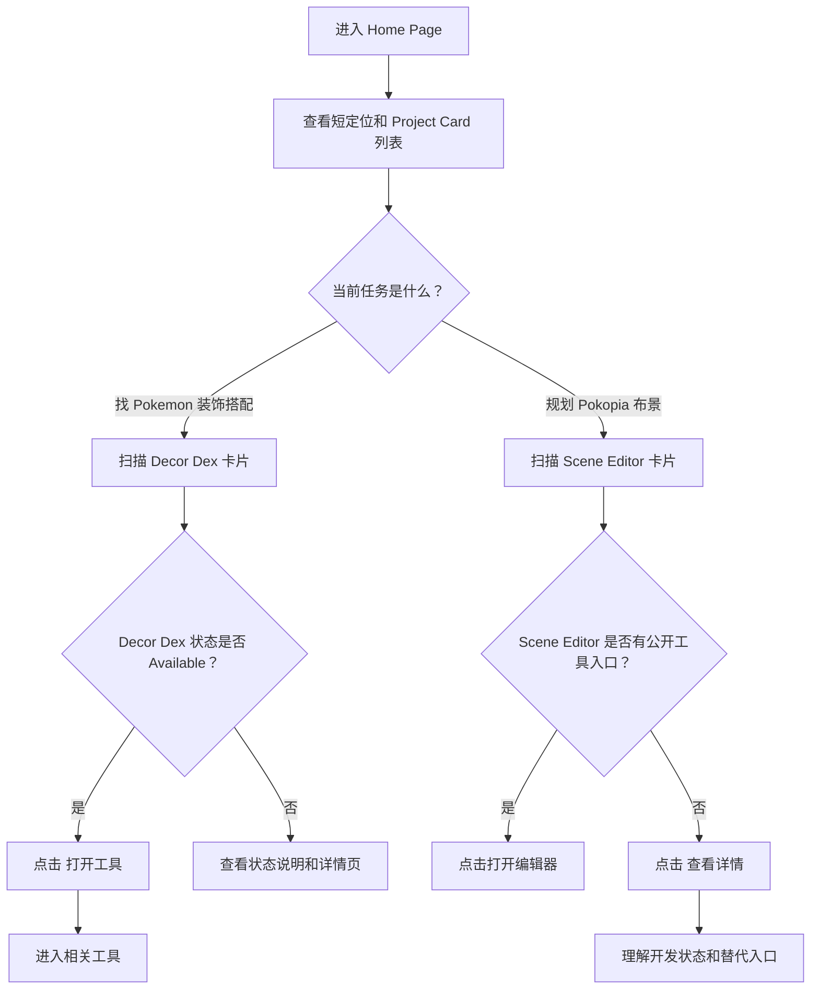
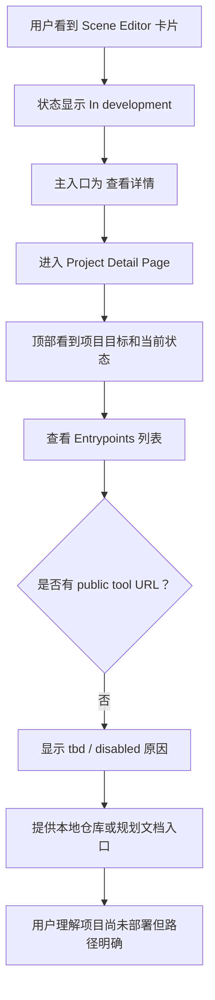
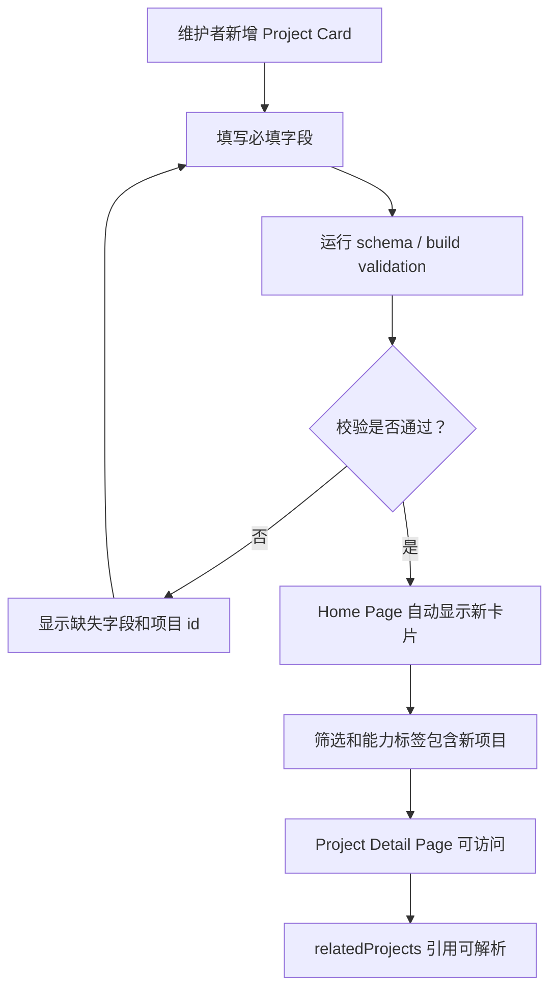
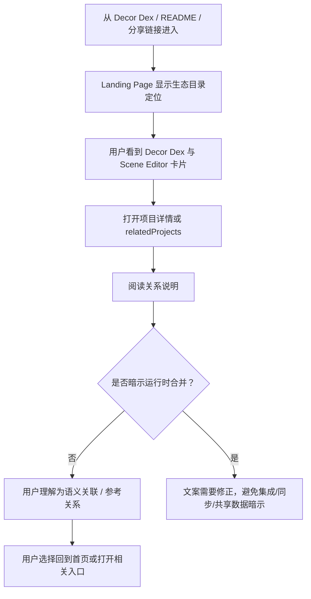

# UX Design Specification landing-page

**Author:** Grigri
**Date:** 2026-05-18

---

<!-- UX design content will be appended sequentially through collaborative workflow steps -->

## Executive Summary

### Project Vision

Pokopia Ecosystem Landing Page 是 Pokopia 工具体系的统一入口，帮助用户快速判断当前有哪些工具、各自解决什么问题、是否可用、从哪里进入，以及工具之间是什么关系。第一版聚焦 Pokopia Decor Dex 和 Pokopia Scene Editor，强调“正确理解和进入工具”，而不是把两个项目合并成一个运行时应用。

### Target Users

主要用户是 Pokopia 创作者，他们需要快速在 Decor Dex 的装饰搭配参考和 Scene Editor 的布景编辑能力之间做选择。次要用户包括 Pokopia 工具维护者，以及从详情页、README 或分享链接进入的回访和分享用户。维护者需要清晰的项目接入模型；回访用户需要理解项目关系，避免误会工具边界。

### Key Design Challenges

- 第一屏必须直接展示项目和入口，避免营销式 hero 稀释“工具目录”的核心任务。
- 项目状态、入口可用性、local-only / disabled / tbd 等状态必须清楚表达，不能让不可用工具看起来可打开。
- 页面要解释 Decor Dex 与 Scene Editor 的关系，但不能暗示它们共享运行时数据、保存格式或已经合并。
- Project Card 需要足够可扫描，同时还能承载 Source Policy、dataFreshness、relatedProjects 等维护者信息。

### Design Opportunities

- 用紧凑的项目卡片、状态徽标、能力标签和明确 CTA，让用户在 30 秒内完成工具选择。
- 把“数据边界”和“维护边界”变成可见 UX，而不是藏在文档里，增强目录页可信度。
- 为未来第三个 Pokopia 项目建立可复用的信息架构：新增 Project Card 后，首页、详情页、筛选和关联关系自然扩展。
- 通过项目详情页把用户入口和维护者上下文分层展示，避免首页过载。

## Core User Experience

### Defining Experience

Landing Page 的核心体验是“快速判断并进入正确工具”。用户打开页面后，应立即看到当前 Pokopia 工具列表、每个工具的状态、用途、能力标签和主入口。最关键的交互是扫描 Project Card 并选择 Entrypoint：用户不需要理解仓库结构或项目内部数据边界，就能判断 Decor Dex 已可打开、Scene Editor 当前开发中，以及每个项目能帮助自己完成什么任务。

### Platform Strategy

第一版应作为静态 Web 体验设计，优先支持桌面和移动浏览。桌面端强调项目对比、筛选和详情跳转；移动端强调纵向扫描、清晰状态和大触控目标。MVP 不依赖离线能力、账号、后端 API 或运行时数据请求。Project Manifest 数据应随静态 bundle 提供，确保页面可独立构建和快速展示。

### Effortless Interactions

- 用户无需阅读长说明即可区分 `Available`、`In development`、`Planned` 等 Project Status。
- 用户无需猜测入口含义即可区分“打开工具”“查看详情”“查看仓库”“查看规划文档”。
- 用户选择状态或能力标签后，Project Card 列表应即时过滤，并在无结果时给出清晰空状态。
- 用户从一个项目详情页查看 relatedProjects 时，应能理解关系是语义或参考关系，而不是运行时合并。
- 维护者新增项目时，UX 应自然支持新卡片出现，不需要为每个项目重新设计页面结构。

### Critical Success Moments

- 用户在 30 秒内判断 Decor Dex 和 Scene Editor 分别用于什么、哪个现在可用、下一步该点哪里。
- 用户看到 Scene Editor 未部署时，没有点击到坏链接，而是获得明确状态说明和替代入口。
- 用户查看项目详情后，理解 Landing Page 只展示项目级公开元数据，不读取 raw assets、SceneDocument 或 adjacent dist。
- 维护者新增第三个 Project Card 后，首页、详情页、筛选和关联关系继续成立。

### Experience Principles

- **入口优先。** 第一屏优先展示项目和行动入口，不使用营销式长 hero。
- **状态诚实。** 不可用、local-only 或 TBD 入口必须可见且有解释，不能伪装成可打开工具。
- **边界可见。** 数据来源、维护边界和不读取内容要以用户可理解的方式呈现。
- **扫描胜过解释。** 卡片、状态、标签和 CTA 应让用户快速判断，而不是依赖长段文字。
- **可扩展但不抽象。** 页面结构服务未来项目接入，但第一版仍要围绕 Decor Dex 和 Scene Editor 的真实差异设计。

## Desired Emotional Response

### Primary Emotional Goals

用户使用 Landing Page 时应感到清楚、可信和可控。清楚来自第一屏直接看到项目、状态和入口；可信来自状态诚实、边界明确、不可用入口有解释；可控来自用户能按状态和能力筛选，并能在详情页理解项目关系和数据来源。

### Emotional Journey Mapping

- **首次进入：** 用户应感到“我知道这里是做什么的”，而不是被营销文案或抽象生态叙事拖慢。
- **扫描项目：** 用户应感到“我能快速比较”，通过 Project Card、状态徽标、能力标签和 CTA 建立判断。
- **选择入口：** 用户应感到“这个入口是可信的”，尤其当工具不可用时，页面仍给出明确状态和替代路径。
- **查看详情：** 用户应感到“边界讲清楚了”，能理解项目用途、来源、相关项目和不读取内容。
- **回访使用：** 用户应感到“这里是稳定目录”，而不是一次性宣传页或过期 README。

### Micro-Emotions

- **信任，而不是怀疑：** 状态和入口必须诚实，不能让用户点击坏链接。
- **安心，而不是困惑：** Decor Dex 与 Scene Editor 的关系要讲清楚，避免误解为运行时合并。
- **效率感，而不是被教育：** 首页优先卡片和入口，长说明下沉到详情页。
- **掌控感，而不是迷路：** 筛选、清除筛选、空状态、返回首页路径都要明确。
- **维护信心，而不是脆弱感：** Project Manifest 和可复用详情结构让维护者相信新增项目不会破坏体验。

### Design Implications

- 状态徽标要有文本、说明和一致语义，不依赖颜色制造暗示。
- 不可用 CTA 要保留可见位置，但用 disabled / tbd / local-only 说明原因和替代路径。
- 首页内容密度应服务比较：卡片信息层级要清楚，避免大段叙事和装饰性模块。
- 详情页应把用户关心的入口信息放前面，把 Source Policy、dataFreshness、doesNotRead 等维护者信息分组展示。
- 关系说明应使用“语义关联”“参考关系”“独立工具”等措辞，避免“集成”“同步”“共享数据”等会制造误解的词。

### Emotional Design Principles

- **诚实比热闹重要。** 不能为了显得完整而弱化项目未部署、local-only 或 TBD 的事实。
- **信任来自可解释。** 每个状态、入口和数据来源都应能解释。
- **减少认知负担。** 首页负责快速判断；详情页负责补充上下文。
- **轻量但不轻浮。** 视觉可以有 Pokopia 气质，但布局必须保持工具目录的清晰和克制。
- **维护者也要安心。** UX 要让新增项目、更新状态、补充来源成为稳定流程。

## UX Pattern Analysis & Inspiration

### Inspiring Products Analysis

本阶段未采用外部参考产品。用户明确选择跳过 inspiration analysis，不提供参考应用或网站。后续 UX 决策应主要从 PRD、Product Brief、Project Manifest 边界、核心体验原则和情绪目标中推导。

### Transferable UX Patterns

无外部产品模式迁移。可继续使用前序已确认的内部模式：

- 紧凑 Project Card 扫描。
- 状态筛选与能力标签筛选。
- 入口类型清晰分层。
- Project Detail Page 承载项目边界、数据来源和相关项目说明。

### Anti-Patterns to Avoid

- 不为了“生态感”加入大段营销 hero 或装饰性模块。
- 不让未部署、local-only 或 tbd 入口看起来像可用工具。
- 不把 Decor Dex 与 Scene Editor 的语义关联表达成运行时合并、同步或共享数据。
- 不把 Source Policy、dataFreshness 和 doesNotRead 信息挤进首页卡片主层级，造成扫描负担。

### Design Inspiration Strategy

本项目的 inspiration strategy 是内部原则优先：以“入口优先、状态诚实、边界可见、扫描胜过解释、可扩展但不抽象”为主要设计约束。后续视觉和组件决策可以引入参考，但不能覆盖已确认的工具目录定位。

## Design System Foundation

### 1.1 Design System Choice

Landing Page 采用 Themeable System 作为设计系统基础：使用一套可主题化的组件、设计 tokens 和布局规则，支撑快速开发、可访问性和长期扩展。该选择强调“稳定组件 + Pokopia 气质定制”，而不是完全自定义 UI 或直接套用强品牌外观的 established system。

### Rationale for Selection

- Landing Page 是轻量静态 Web 目录，核心任务是扫描、筛选、进入和理解项目边界，不需要高成本的完全自定义设计系统。
- Project Card、状态徽标、能力标签、筛选控件、详情页信息组、CTA 和空状态都适合用可复用组件表达。
- 产品需要一点 Pokopia 识别感，但不能牺牲工具目录的清晰、可信和克制。
- 未来新增第三个项目时，Themeable System 可以通过同一套 card、badge、tag、entrypoint 和 detail section 模式扩展。
- 设计系统必须支持可访问状态表达，避免只靠颜色区分状态。

### Implementation Approach

- 建立基础 design tokens：颜色、字体层级、间距、边框、阴影、状态色和交互状态。
- 定义核心组件：Project Card、Status Badge、Capability Tag、Entrypoint Button、Filter Control、Detail Section、Source Policy Block、Empty State、Related Project Link。
- 优先实现响应式 Web 布局：桌面端支持横向比较和筛选，移动端支持纵向扫描和大触控目标。
- 保持组件数据驱动：组件从 Project Manifest 接收数据，不为每个项目写专属 UI。
- 所有状态组件必须有文本标签和辅助说明，不能仅依赖颜色。

### Customization Strategy

- 视觉语气应轻量、有 Pokopia 气质，但布局保持工具索引的密度和秩序。
- 状态色应克制使用：用于增强识别，不替代文字。
- Project Card 的第一层只放用户选择工具所需信息；Source Policy、dataFreshness、doesNotRead 等维护者信息放到详情页或卡片次级区域。
- 主题定制应围绕 tokens 完成，避免在单个项目卡片里写一次性样式。
- 若后续 architecture 选择具体 UI 框架，UX 约束仍以本节定义的组件语义和信息层级为准。

## 2. Core User Experience

### 2.1 Defining Experience

Landing Page 的定义体验是“看见卡片 -> 理解状态 -> 选择入口”。用户打开页面后，不需要先读长文案或理解仓库结构，就能通过 Project Card 判断每个 Pokopia 工具的用途、状态、能力和可用入口。体验成功时，用户会用一句话描述它：“这里能直接告诉我该打开哪个 Pokopia 工具。”

### 2.2 User Mental Model

用户带来的心智模型是“工具目录”而不是“营销站”或“统一工作台”。他们期待看到可比较的工具条目、清晰的当前状态、可点击入口和必要时的详情说明。Pokopia 创作者按任务思考：找搭配进入 Decor Dex，做布景进入 Scene Editor。维护者按项目记录思考：新增项目应通过 Project Manifest 自动进入同一套卡片、筛选和详情结构。

用户最容易困惑的地方是项目关系和入口状态：Decor Dex 与 Scene Editor 有语义关联，但不是一个应用；Scene Editor 有规划和详情入口，但公开工具入口可能尚未部署。因此 UX 必须避免把 relatedProjects 表达成运行时集成，也必须避免把 disabled / tbd / local-only 入口伪装成 available。

### 2.3 Success Criteria

- 用户在第一屏看到至少两个 Project Card，并能立即说出每个项目的用途和状态。
- 用户能在 30 秒内完成一个入口选择：打开 Decor Dex、查看 Scene Editor 详情、查看仓库或查看规划文档。
- 用户选择筛选条件后，列表反馈即时、可理解；无结果时提供清晰空状态和清除路径。
- 用户进入详情页后，能理解 Source Policy、dataFreshness 和 relatedProjects 的含义。
- 维护者新增合法 Project Card 后，不需要新增项目专属 UI 即可获得可用展示。

### 2.4 Novel UX Patterns

本项目不需要发明新的交互模式。核心体验应采用成熟模式：项目卡片、状态徽标、标签筛选、明确 CTA、详情页分组信息和空状态。创新点不在交互新奇，而在把项目边界、数据来源和入口可用性做成可见、可信、可维护的信息结构。

### 2.5 Experience Mechanics

**1. Initiation**

用户进入 Home Page。页面顶部用短句说明这是 Pokopia 工具目录，随后立即展示筛选控件和 Project Card 列表。第一屏不使用长 hero。

**2. Interaction**

用户扫描 Project Card：先看项目名称和 tagline，再看 Project Status、Capability Tag 和主 CTA。需要缩小范围时，用户使用状态筛选或能力标签筛选。需要更多上下文时，用户进入 Project Detail Page。

**3. Feedback**

状态徽标、入口可用性、disabled / tbd / local-only 说明和筛选结果数量共同提供反馈。筛选后列表即时更新；无结果时展示空状态和清除筛选操作。点击外部工具入口前，链接类型和文案应让用户知道将打开相关项目。

**4. Completion**

完成动作包括：打开可用工具、进入项目详情、查看仓库/规划文档，或确认某项目尚不可用但知道后续路径。完成后用户应知道自己没有误点坏链接，也没有误解项目边界。

**5. Recovery**

如果用户进入未知项目详情路由，页面展示 not-found 状态并提供返回 Home Page 或有效项目列表的路径。如果入口不可用，页面不隐藏入口，而是说明原因和替代操作。

## Visual Design Foundation

### Color System

视觉基底采用明亮、克制、可读的工具目录色系。主背景使用接近白色的浅色底，正文使用高对比深色文字；品牌气质通过少量自然绿、清澈蓝、暖橙和柔和紫作为 accent，而不是用大面积渐变或单一主色覆盖页面。

**Recommended Tokens**

- `--color-bg`: `#F7FAF8`，页面背景。
- `--color-surface`: `#FFFFFF`，Project Card、详情内容区和控件表面。
- `--color-text`: `#17211C`，主文字。
- `--color-muted`: `#66736D`，次级说明文字。
- `--color-border`: `#D9E1DD`，卡片、分组和控件边界。
- `--color-primary`: `#2E7D5B`，主要行动、可用工具入口和重点链接。
- `--color-secondary`: `#2F6FED`，信息型链接、相关项目和详情入口。
- `--color-accent-warm`: `#D97845`，少量强调或 Pokopia 气质点缀。
- `--color-accent-soft`: `#8B6BD6`，实验性状态或轻量视觉变化。

**Status Colors**

- `available`: green + visible text.
- `in-development`: blue + visible text.
- `planned`: amber + visible text.
- `experimental`: purple + visible text.
- `maintenance`: neutral gray + visible text.
- `archived`: muted graphite + visible text.

颜色只用于辅助识别；所有状态必须有文字标签和说明。

### Typography System

使用系统 sans-serif 或后续 architecture 选择的现代 UI 字体。目标是清晰、紧凑、可扫描，不追求 editorial 或营销式表现。

**Type Scale**

- Page title: 32-40px desktop, 28-32px mobile.
- Section heading: 20-24px.
- Card title: 18-20px.
- Body: 15-16px.
- Metadata / tags: 12-14px.
- Buttons: 14-15px, medium weight.

行高保持舒适但不松散：正文约 1.5，卡片元数据约 1.35。不要使用随 viewport width 缩放的字体大小。

### Spacing & Layout Foundation

采用 8px spacing base。整体布局应紧凑、有秩序，优先服务比较和入口选择。

**Home Page Layout**

- 第一屏包含短标题、简短定位、筛选控件和 Project Card 列表，不使用长 hero。
- Desktop 使用受控宽度内容区和 2-column card grid；项目数量增加时可扩展到响应式 grid。
- Mobile 使用单列 Project Card，筛选控件换行排列，CTA 保持容易点击。
- 卡片圆角不超过 8px，避免过度柔和或装饰化。
- 卡片内部层级：名称 / 状态 / tagline / capability tags / entrypoints。

**Detail Page Layout**

- 顶部展示项目名称、状态、tagline 和主要入口。
- 中部展示核心能力、适合谁、入口列表和 relatedProjects。
- 下部展示 Source Policy、dataFreshness、doesNotRead 等维护者信息。

### Accessibility Considerations

- 所有文本与背景必须满足 WCAG AA 对比度。
- 状态、可用性和错误信息不能只依赖颜色。
- Filter Control、Entrypoint Button 和 Project Card 内链接必须支持键盘导航。
- Disabled / tbd / local-only 入口必须可读、可解释，不能只做灰色不可点。
- Mobile 触控目标建议不小于 44px 高。
- 长标签和项目名称必须可换行，不能挤压 CTA 或造成布局重排。

## Design Direction Decision

### Design Directions Explored

本阶段生成了 6 个设计方向展示在 `_bmad-output/planning-artifacts/ux-design-directions.html`：

1. **Compact Trust Index** — 第一屏直接展示短定位、筛选和两张核心 Project Card。
2. **Split Directory** — 左侧固定筛选，右侧项目卡片列表。
3. **Tag Board** — 以能力标签为主要发现入口。
4. **Detail Led** — 更早突出 Source Policy、数据来源和项目边界。
5. **Maintainer Console** — 偏维护者审核和 manifest 状态的深色控制台方向。
6. **Soft Map** — 用更柔和的路径地图表达 Decor Dex 到 Scene Editor 的关系。

### Chosen Direction

默认锁定 **Direction 1: Compact Trust Index**。它最符合已确认的核心体验：看见卡片、理解状态、选择入口。该方向把项目对比和入口选择放在第一屏，不让装饰性生态叙事压过工具目录任务。

### Design Rationale

- 它最大化支持 30 秒内完成工具选择的成功标准。
- 它保持 Home Page 信息密度，避免营销式长 hero。
- 它让 Project Status、Capability Tag 和 Entrypoint 在同一个扫描范围内出现。
- 它能清楚表达 Scene Editor 未部署状态，不制造坏链接期待。
- 它仍可扩展到第三个项目，不需要改变整体信息架构。

其他方向可作为局部参考：Tag Board 的能力筛选、Detail Led 的 Source Policy 分组、Soft Map 的关系说明可以被吸收到 Compact Trust Index 的详情页和辅助区域中；Maintainer Console 不适合作为默认用户界面，但可启发维护者视图或调试页。

### Implementation Approach

- Home Page 采用短定位 + filter toolbar + Project Card grid 的结构。
- Desktop 默认 2-column Project Card grid；mobile 默认单列卡片。
- Project Card 第一层包含 name、tagline、Project Status、Capability Tags 和主要 Entrypoint。
- Source Policy、dataFreshness、doesNotRead 和 initializedFrom 放在 Project Detail Page 或卡片次级展开区域。
- HTML showcase 是 UX 方向参考，不是最终实现代码；后续 architecture 应把 Direction 1 转换为真实组件和路由结构。

## User Journey Flows

### UJ-1: Pokopia 创作者选择正确工具

用户目标：快速判断 Decor Dex 和 Scene Editor 分别解决什么问题，并打开当前可用的正确入口。

关键 UX 要求：

- Project Card 第一层必须同时出现用途、状态、能力标签和主 Entrypoint。
- 可用工具入口必须比详情入口更突出；不可用工具不能出现伪装的启动 CTA。
- 相关项目说明只能表达语义关系或参考关系。

### UJ-2: Pokopia 创作者查看开发中项目的可用路径

用户目标：确认 Scene Editor 当前不可直接打开时，仍能知道下一步可做什么。

关键 UX 要求：

- Disabled / tbd / local-only 入口必须可见且有说明。
- Detail Page 顶部先回答“它能做什么”和“现在能不能用”，维护者信息下沉。
- 用户应始终有返回 Home Page 或查看其他 Project Card 的路径。

### UJ-3: Pokopia 工具维护者新增第三个项目

用户目标：维护者通过 Project Manifest 新增项目，并确认 UX 自动支持新项目。

关键 UX 要求：

- 校验错误应面向维护者，指出字段、项目 id 和修复方向。
- 新项目不应要求新建专属页面组件。
- Detail Page 结构必须能容纳未知未来项目类型，但不牺牲首批两个项目的具体性。

### UJ-4: 回访和分享用户从外部链接理解生态关系

用户目标：从外部页面进入 Landing Page 后，理解两个项目之间的关系和边界。

关键 UX 要求：

- 关系说明使用“语义关联”“参考关系”“独立工具”等措辞。
- Source Policy 和 doesNotRead 帮助消除数据共享误解。
- 外部链接和站内详情链接在视觉与文案上必须可区分。

### Journey Patterns

- **Home -> Project Card -> Entrypoint** 是主路径，所有次级信息都不能阻碍这个路径。
- **Status first, action second**：先让用户理解状态，再给出可执行入口。
- **Detail page as context layer**：详情页承载项目边界、来源、关系和不可用原因。
- **Validation as maintainer UX**：manifest 校验错误也是 UX 的一部分，需要清晰可修复。
- **Recovery always visible**：无结果、未知项目、不可用入口都必须提供返回或替代路径。

### Flow Optimization Principles

- 第一屏减少解释文字，把判断所需信息压缩在 Project Card 上。
- 任何入口点击前，用户都应知道将打开工具、详情、仓库、文档还是外部站点。
- 筛选反馈必须即时；空状态必须包含清除筛选操作。
- 维护者信息按需展开或放到详情页，避免压低普通用户的扫描效率。
- 错误和不可用状态用清楚语言解释，不用颜色或 disabled 样式单独承担含义。

## Component Strategy

### Design System Components

基础 design system 应提供以下通用组件能力：

- Button / Link Button：用于工具入口、详情入口、仓库和文档链接。
- Badge / Pill：用于 Project Status、Project Type 和 dataFreshness。
- Tag / Chip：用于 Capability Tag 和筛选条件。
- Card：用于 Project Card 和信息分组。
- Tabs / Segmented Control：用于状态筛选或详情页分区，视实现复杂度决定。
- Disclosure / Accordion：用于 Source Policy、doesNotRead、initializedFrom 等次级信息。
- Alert / Empty State：用于无筛选结果、未知项目、不可用入口说明。
- Layout primitives：container、grid、stack、inline、divider。

### Custom Components

#### Project Card

**Purpose:** 帮用户快速判断项目用途、状态和下一步入口。
**Usage:** Home Page 项目列表主组件。
**Anatomy:** name、tagline、Project Status、Project Type、Capability Tags、primary Entrypoint、secondary Entrypoints、optional note。
**States:** default、hover/focus、filtered-visible、filtered-hidden、available、in-development、planned、archived。
**Accessibility:** 卡片内可点击元素必须独立聚焦；卡片整体不应包裹多个交互目标；状态文本必须可读。
**Content Guidelines:** tagline 一句话说明“能用它做什么”；标签不超过首屏可读范围，过长时换行。
**Interaction Behavior:** 点击主 CTA 执行最可信入口；点击详情进入 Project Detail Page。

#### Status Badge

**Purpose:** 表达 Project Status 和 Entrypoint Availability。
**Usage:** Project Card、Project Detail Page、Entrypoint List。
**Anatomy:** visible label、semantic color、optional short note。
**States:** available、in-development、planned、experimental、maintenance、archived、disabled、local-only、tbd。
**Accessibility:** 颜色只作辅助；label 必须包含完整状态含义。
**Content Guidelines:** 状态文案应面向用户解释可行动性，例如 “In development - 查看详情”。
**Interaction Behavior:** 非交互徽标默认不可点击；如提供说明，应通过 tooltip 或 adjacent note 实现。

#### Capability Tag

**Purpose:** 帮用户按能力理解和筛选项目。
**Usage:** Project Card、filter toolbar、Project Detail Page。
**Anatomy:** tag label、selected state、count optional。
**States:** default、hover/focus、selected、disabled。
**Accessibility:** 筛选标签使用 button 或 checkbox 语义；selected state 不能只靠颜色。
**Content Guidelines:** 标签使用用户可理解词，例如 `Pokemon 色彩`、`装饰推荐`、`7x7 画布`、`建筑层`。
**Interaction Behavior:** 选择后即时过滤列表；再次点击可取消。

#### Entrypoint Button

**Purpose:** 明确区分打开工具、查看详情、查看仓库、查看规划文档和外部链接。
**Usage:** Project Card、Project Detail Page。
**Anatomy:** action label、kind indicator、availability state、optional note。
**States:** primary、secondary、external、disabled、local-only、tbd。
**Accessibility:** disabled / tbd 状态仍需有可读说明；外链应标明目的。
**Content Guidelines:** 不用“打开工具”描述 repo/docs；每个 label 必须说明真实动作。
**Interaction Behavior:** available link 可点击；disabled / tbd 展示原因和替代路径。

#### Project Detail Header

**Purpose:** 在详情页顶部回答“这是什么、现在能否使用、下一步去哪”。
**Usage:** 每个 Project Detail Page 顶部。
**Anatomy:** name、status、tagline、primary Entrypoint、secondary Entrypoints、relationship summary optional。
**States:** available project、in-development project、archived project。
**Accessibility:** heading hierarchy 必须稳定；入口顺序与视觉优先级一致。
**Content Guidelines:** 顶部不承载长 Source Policy，只放决策信息。
**Interaction Behavior:** 入口操作与 Project Card 保持一致。

#### Source Policy Block

**Purpose:** 把数据来源、doesNotRead 和维护边界可视化。
**Usage:** Project Detail Page 下部或维护者区域。
**Anatomy:** displaySource、initializedFrom、doesNotRead、dataFreshness。
**States:** compact、expanded。
**Accessibility:** 列表结构清楚；路径和 key 用 monospace。
**Content Guidelines:** 用“本页读取 / 本页不读取”表达，避免内部术语裸奔。
**Interaction Behavior:** 可折叠，但不要隐藏到用户完全找不到的位置。

#### Related Project Link

**Purpose:** 表达项目之间的语义或参考关系。
**Usage:** Project Detail Page relatedProjects 区域。
**Anatomy:** target project name、relationship text、link to detail page。
**States:** resolved、missing target。
**Accessibility:** link text 必须说明目标和关系。
**Content Guidelines:** 使用“语义关联”“参考关系”“独立工具”，避免“同步”“集成”“共享数据”。
**Interaction Behavior:** resolved link 进入目标详情；missing target 在开发期暴露校验错误。

### Component Implementation Strategy

- 用 design tokens 驱动颜色、间距、边框、文字层级和状态样式。
- Project Card 和 Project Detail Page 都从 Project Manifest 派生，避免项目专属组件。
- 状态和入口组件必须共享 enum 到 UI label 的映射，避免卡片和详情页文案漂移。
- 筛选控件与 Capability Tag 复用同一视觉语言，但交互语义明确为 filter button / checkbox。
- Source Policy Block 和 Related Project Link 优先服务详情页，不挤占首页首屏主路径。

### Implementation Roadmap

**Phase 1 - Core Components**

- Project Card
- Status Badge
- Capability Tag
- Entrypoint Button
- Filter Control
- Empty State

**Phase 2 - Detail Components**

- Project Detail Header
- Entrypoint List
- Source Policy Block
- Related Project Link
- Not Found State

**Phase 3 - Maintainer / Expansion Components**

- Manifest Validation Error Summary
- Project Metadata Table
- Optional Screenshot Block
- Public Project Manifest Status Block

## UX Consistency Patterns

### Button Hierarchy

**When to Use:** 所有 Entrypoint、筛选操作、返回路径和错误恢复操作。
**Visual Design:** primary button 用于最可信的下一步；secondary button 用于详情、仓库、文档；disabled/tbd/local-only 使用可读说明而不是单纯灰掉。
**Behavior:** 每个按钮 label 必须说明真实动作，不使用泛化的“查看”或“打开”替代具体含义。
**Accessibility:** button 或 link 语义必须匹配真实行为；外链应可被识别；键盘 focus ring 可见。
**Mobile Considerations:** 触控目标不小于 44px，按钮可换行或分组，不能挤压状态说明。
**Variants:** primary tool、detail、repo/docs、external、disabled、local-only、tbd。

### Feedback Patterns

**When to Use:** 筛选结果变化、不可用入口、校验错误、未知项目、外链跳转前说明。
**Visual Design:** 反馈信息靠近触发点；状态用 badge + 文本说明；错误或不可用状态不只靠颜色。
**Behavior:** 用户执行筛选后即时更新列表；点击不可用入口前应已能看到原因；未知项目显示返回路径。
**Accessibility:** 重要动态结果应可被辅助技术感知；错误信息用文本描述。
**Mobile Considerations:** 反馈文案短而清晰，避免占据整屏。
**Variants:** info、success、warning、error、empty、not-found。

### Form Patterns

MVP 面向浏览，不需要复杂表单。涉及维护者输入或未来 manifest 编辑时，遵循以下模式：

**When to Use:** 未来 manifest editing、search/filter input、link checking configuration。
**Visual Design:** label 始终可见；helper text 明确字段含义；错误信息靠近字段。
**Behavior:** 枚举字段使用 select / segmented control，避免自由文本导致拼写错误。
**Accessibility:** label 与 input 绑定；错误摘要可聚焦；键盘可完整操作。
**Mobile Considerations:** 输入控件全宽，避免多列字段。

### Navigation Patterns

**When to Use:** Home Page、Project Detail Page、not-found、relatedProjects。
**Visual Design:** Home Page 是中心；详情页顶部必须提供返回 Home Page；relatedProjects 使用明确 link row。
**Behavior:** Project Detail Page 路径由 project id 派生；未知 id 进入 not-found；外部工具链接不伪装成站内路由。
**Accessibility:** heading hierarchy 稳定；breadcrumb 或返回链接文字明确。
**Mobile Considerations:** 不依赖侧边栏；所有导航路径在单列布局中可见。
**Variants:** home、project detail、related project、external tool、not-found recovery。

### Search and Filtering Patterns

**When to Use:** 状态筛选、能力标签筛选、未来项目数量增加后的搜索。
**Visual Design:** filter toolbar 位于 Project Card 列表前；active filter 用 text + visual state 表达；提供清除筛选。
**Behavior:** MVP 默认 AND 逻辑；筛选即时生效；空结果展示原因和清除操作。
**Accessibility:** 筛选控件使用 button / checkbox 语义；active state 可读。
**Mobile Considerations:** filter chips 可换行；不使用横向滚动作为唯一访问方式。
**Variants:** status filter、capability filter、clear all、empty results。

### Empty, Disabled, and Not Found States

**When to Use:** 无筛选结果、入口 tbd / disabled、本地路径不可用、未知项目详情页。
**Visual Design:** 用短标题 + 原因 + 下一步操作；不使用空白或仅图标状态。
**Behavior:** 空结果可清除筛选；disabled/tbd 显示原因和替代入口；not-found 回到 Home Page 或显示有效项目列表。
**Accessibility:** 状态标题和说明使用文本；不可用入口不作为空链接。
**Mobile Considerations:** 下一步操作保持可点击且不被长说明推到过深位置。
**Variants:** no filter results、tool unavailable、local-only、unknown project。

### Additional Patterns

- **Source Policy disclosure:** 默认在详情页可见摘要，展开查看 initializedFrom 和 doesNotRead。
- **Related project relation:** 总是包含关系说明，不能只显示项目名。
- **Project metadata:** 用分组列表呈现，不混入用户主 CTA 区域。
- **External link clarity:** 外部链接在 label 或辅助文本中说明目标项目。
- **Validation summary:** 面向维护者显示字段名、项目 id 和修复方向。

## Responsive Design & Accessibility

### Responsive Strategy

**Desktop 1024px+**

- 使用受控内容宽度和 2-column Project Card grid，优先支持比较。
- Filter toolbar 位于 Project Card grid 上方，允许多行但不应压过首批卡片。
- Project Detail Page 可使用两栏结构：主内容 + metadata / Source Policy 辅助栏。
- Desktop 可以显示更多 capability tags 和 secondary entrypoints，但仍保持主 CTA 明确。

**Tablet 768px-1023px**

- 使用单列或窄双列 grid，取决于 Project Card 最小宽度。
- 筛选控件支持换行和触控。
- Detail Page 从两栏降级为分区堆叠，保持 Header 和 Entrypoints 在最前。

**Mobile 320px-767px**

- 使用单列 Project Card。
- Filter chips 可换行，不使用横向滚动作为唯一访问方式。
- CTA 垂直堆叠或使用全宽按钮，触控目标不小于 44px。
- Project Card 信息优先级为 status、name、tagline、capability tags、primary Entrypoint。
- Source Policy、doesNotRead、initializedFrom 等维护者信息默认放到详情页下部。

### Breakpoint Strategy

- Mobile: `320px-767px`
- Tablet: `768px-1023px`
- Desktop: `1024px+`

采用 mobile-first CSS，再在 tablet 和 desktop 增强布局密度。Project Card 应设置稳定最小宽度和响应式 grid tracks，避免标签、按钮或长项目名称造成布局跳动。不要使用 viewport-based font scaling。

### Accessibility Strategy

目标为 WCAG 2.1 AA。

关键要求：

- 正文与背景对比度至少 4.5:1；大号文本至少 3:1。
- 状态、错误、入口可用性不得只靠颜色表达。
- 所有 Entrypoint Button、Filter Control、Related Project Link 和返回链接必须支持键盘导航。
- Focus state 必须可见，不能被自定义样式移除。
- Project Card 不应整体嵌套多个交互目标；卡片内链接/按钮各自可聚焦。
- Mermaid 或未来图示内容必须有文本替代或旁边结构化说明。
- 外链、local-only、disabled、tbd 状态必须有明确文本说明。

### Testing Strategy

**Responsive Testing**

- 检查 390x844、768x1024、1024x768、1440x900。
- 检查长项目名、长 capability tag、多个 entrypoints、空筛选结果。
- 检查 filter toolbar 换行后不遮挡 Project Card。
- 检查 Project Detail Page 在 mobile 下 Header、Entrypoints 和 status 仍在前部可见。

**Accessibility Testing**

- 自动化检查：axe 或同类工具。
- 手动键盘检查：Tab 顺序、Enter/Space 操作、focus ring。
- 颜色检查：状态 badge 在色弱模拟下仍可读。
- 屏幕阅读器抽查：Project Card、Status Badge、Entrypoint Button 和 Empty State。

**Content Testing**

- 检查“打开工具”“查看详情”“查看仓库”“查看规划文档”是否真实对应动作。
- 检查 relatedProjects 文案不暗示运行时合并。
- 检查 disabled / tbd / local-only 都有原因和替代路径。

### Implementation Guidelines

- 使用 semantic HTML：`main`、`section`、`article`、`nav`、`button`、`a`。
- Filter Control 使用真实 button/checkbox 语义，并提供 `aria-pressed` 或等价状态。
- Status Badge 以可见文本表达状态，不依赖 `aria-label` 替代视觉文本。
- Project Card 使用 `article`，内部 CTA 独立为 links/buttons。
- Not Found 和 Empty State 提供标题、说明和可执行恢复操作。
- 使用 `rem`、百分比、CSS grid/flex 和 container constraints；避免固定高度导致内容溢出。
- 所有视觉 tokens 应集中定义，组件不得散落一次性颜色。
